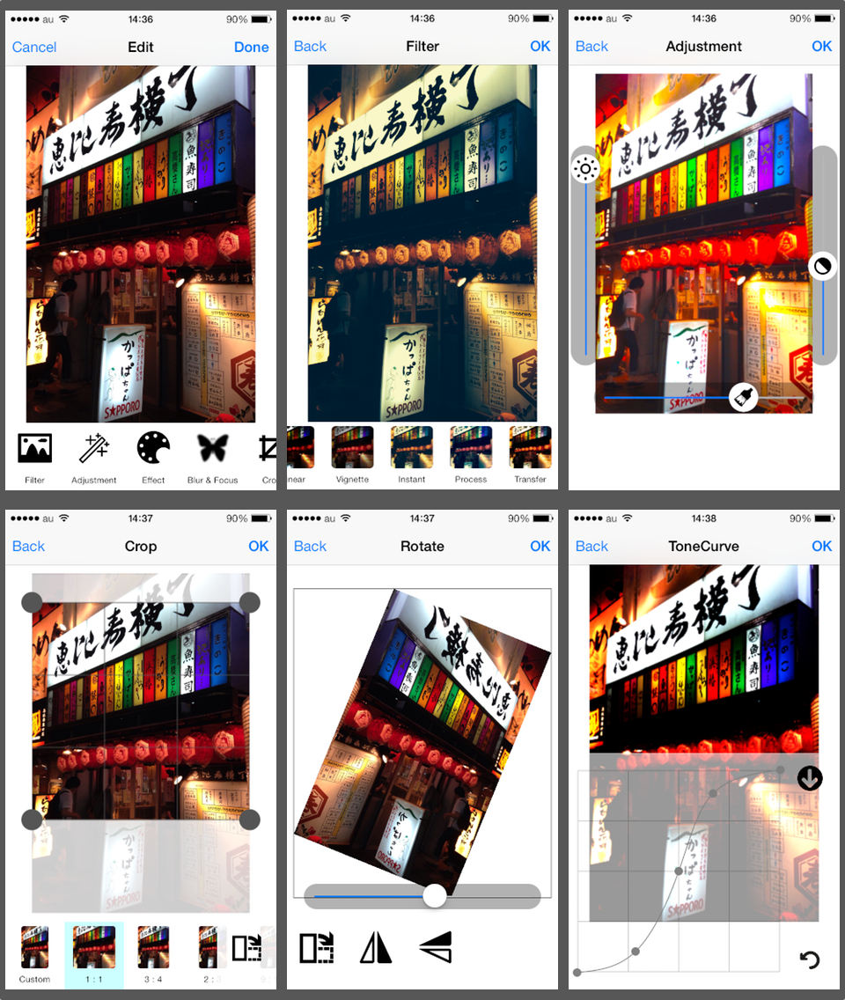

CLImageEditor
===

CLImageEditor provides basic image editing features to iPhone apps. This ViewController is simple to use, and is also possible to incorporate as part of the UIImagePickerController easily.





Installing
---

The easiest way to use CLImageEditor is to copy all the files in the CLImageEditor group (or directory) into your app. Alternatively, you should be able to setup a git submodule and reference the files in your Xcode project.

Add the following frameworks to your project: CoreGraphics, CoreImage, Accelerate

##### Or CocoaPods

`pod 'CLImageEditor'`


Usage
---
Getting started with CLImageEditor is dead simple. Just initialize it with an UIimage and set a delegate. Then you can use it as a usual ViewController.


```  objc

#import "CLImageEditor.h"

@interface ViewController()
<CLImageEditorDelegate>
@end

- (void)presentImageEditorWithImage:(UIImage*)image
{
    CLImageEditor *editor = [[CLImageEditor alloc] initWithImage:image];
    editor.delegate = self;
	
    [self presentViewController:editor animated:YES completion:nil];
}

```

When used with UIImagePickerController, CLImageEditor can be made to function as a part of the picker by to call the picker's `pushViewController:animated:`.

```  objc

#pragma mark- UIImageController delegate

- (void)imagePickerController:(UIImagePickerController *)picker didFinishPickingMediaWithInfo:(NSDictionary *)info
{
    UIImage *image = [info objectForKey:UIImagePickerControllerOriginalImage];
    
    CLImageEditor *editor = [[CLImageEditor alloc] initWithImage:image];
    editor.delegate = self;
    
    [picker pushViewController:editor animated:YES];
}

```

After a image has been edited, the editor will call delegate's `imageEditor:didFinishEdittingWithImage:` method. The delegate's method is required to receive edited image.

```  objc


#pragma mark- CLImageEditor delegate

- (void)imageEditor:(CLImageEditor *)editor didFinishEdittingWithImage:(UIImage *)image
{
    _imageView.image = image;
    [editor dismissViewControllerAnimated:YES completion:nil];
}

```

Additionally, the optional delegate's `imageEditorDidCancel:` method is provided for when you want to catch the cancel callback.

For more detail,  please see `CLImageEditorDemo`.


Customizing
---
Icon images are included in `CLImageEditor.bundle`.  You can change the appearance by rewriting the icon images.

Other features for theme settings not yet implemented.


License
---
CLImageEditor is released under the MIT License, see [LICENSE](LICENSE).